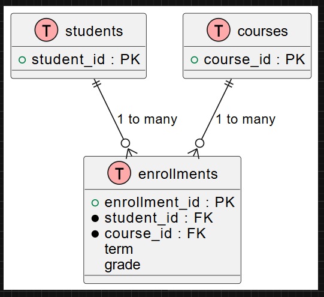
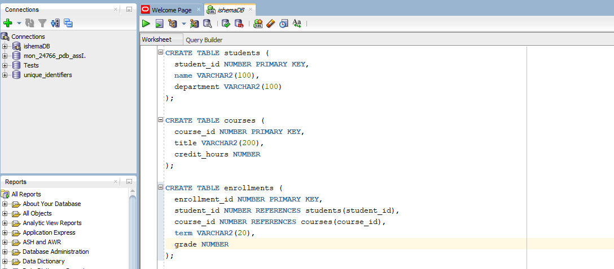
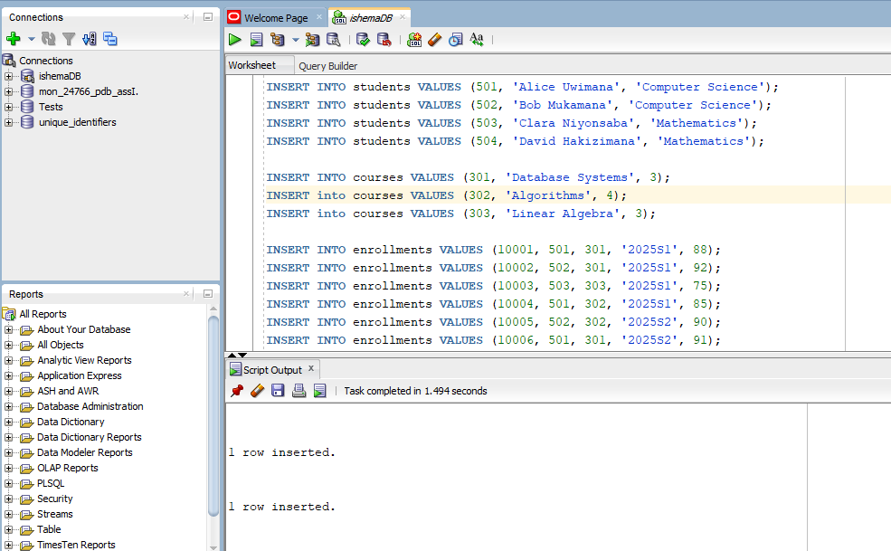
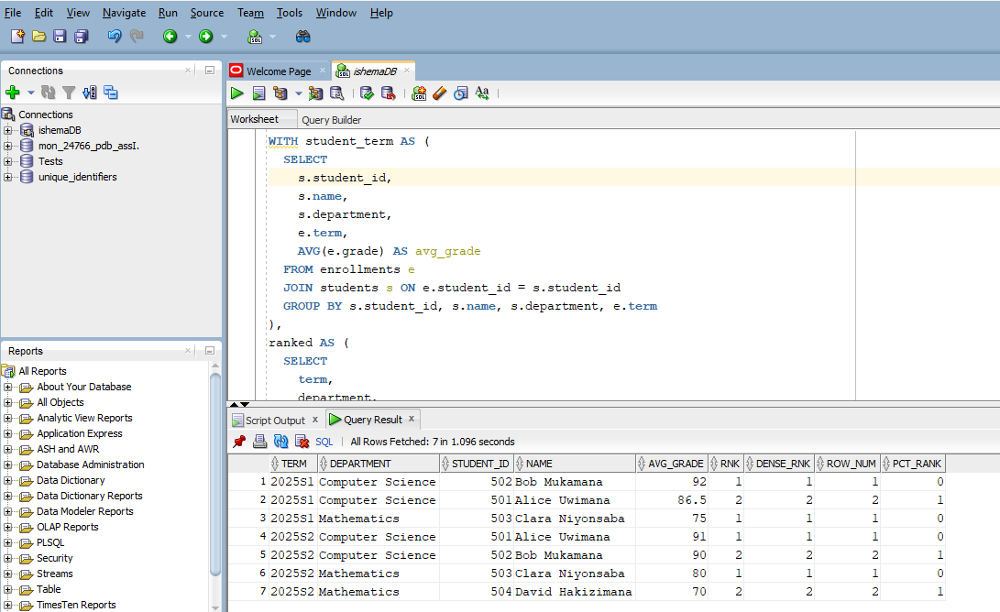
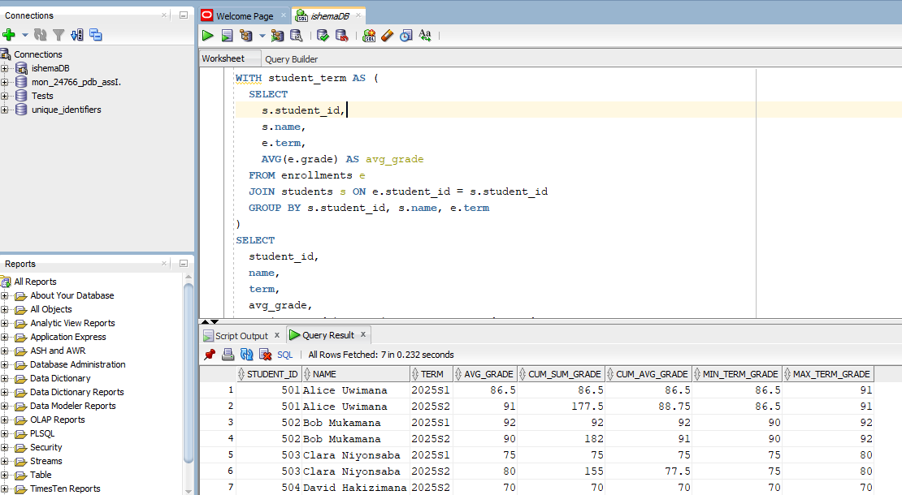
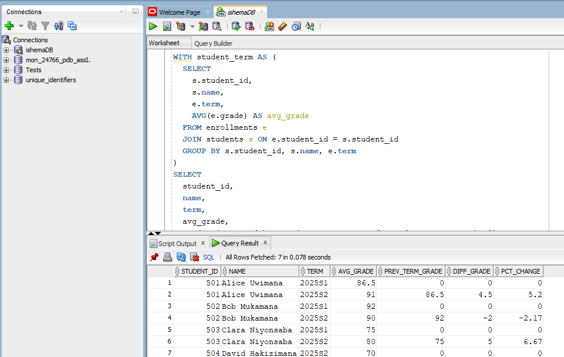
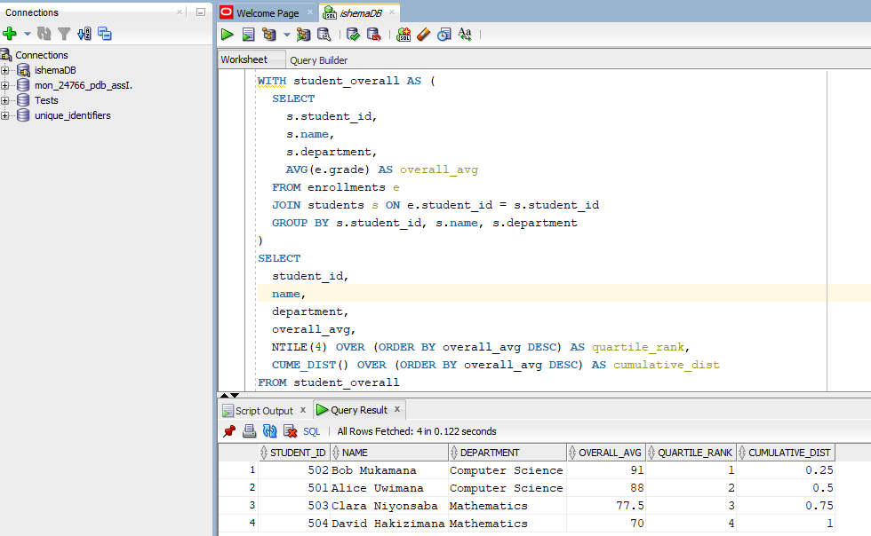

# Window Functions


Names:

* IRAGENA SHEMA Cedrick&nbsp;&nbsp;24766.


#  PL/SQL Window Functions Mastery Project


### Step1: Problem Definition 

## Business/Institutional Context:

A university’s academic affairs office wants to improve student performance monitoring across departments. The university offers many courses, and students register in those courses each term. The administration wants to analyze grades over time, identify top-performing students, and segment students by performance quartiles.

## Data Challenge:

Despite collecting enrollment and grade data each term, the university struggles to quickly gain insights like identifying top students each semester, tracking individual performance over time, and classifying students into performance tiers for targeted support.

## Expected Outcome:

By using window functions, the university can rank top students by department and term, track GPA trends over time, measure academic improvement or decline between terms, segment students into performance quartiles, and calculate moving GPA averages to support academic advisors and leadership.

### Step2: Success Criteria

## 5 measurable goals:

1.	Top 5 students per department/term → via RANK() or DENSE_RANK()
2.	Running cumulative GPA or grade sum per student over terms → via SUM() OVER()
3.	Term-over-term improvement (grade change % or difference) → via LAG() / LEAD()
4.	Student performance quartiles → via NTILE(4)
5.	3-term moving average of GPA or grade sum → via AVG() OVER()


### Step3: Database Schema

| Table        | Purpose                          | Key Columns                                                                 |
|--------------|----------------------------------|------------------------------------------------------------------------------|
| students     | Student master information       | `student_id` (PK), `name`, `department`                                     |
| courses      | Course catalog                   | `course_id` (PK), `title`, `credit_hours`                                   |
| enrollments  | Records of students taking courses | `enrollment_id` (PK), `student_id` (FK → students.student_id), `course_id` (FK → courses.course_id), `term`, `grade` |

<br><br><br><br>

### ER Diagram

Screenshot:




<br><br><br><br>


### Table creation and inserts

* Table creation

```sql
CREATE TABLE students (
  student_id NUMBER PRIMARY KEY,
  name VARCHAR2(100),
  department VARCHAR2(100)
);

```

```sql
CREATE TABLE courses (
  course_id NUMBER PRIMARY KEY,
  title VARCHAR2(200),
  credit_hours NUMBER
);

```

```sql
CREATE TABLE enrollments (
  enrollment_id NUMBER PRIMARY KEY,
  student_id NUMBER REFERENCES students(student_id),
  course_id NUMBER REFERENCES courses(course_id),
  term VARCHAR2(20),
  grade NUMBER  -- numeric grade, e.g. 0–100 or on scale
);

```

Screenshot:




<br><br><br><br>


* Query to insert data 

```sql
INSERT INTO students VALUES (501, 'Alice Uwimana', 'Computer Science');
INSERT INTO students VALUES (502, 'Bob Mukamana', 'Computer Science');
INSERT INTO students VALUES (503, 'Clara Niyonsaba', 'Mathematics');
INSERT INTO students VALUES (504, 'David Hakizimana', 'Mathematics');

INSERT INTO courses VALUES (301, 'Database Systems', 3);
INSERT into courses VALUES (302, 'Algorithms', 4);
INSERT into courses VALUES (303, 'Linear Algebra', 3);

INSERT INTO enrollments VALUES (10001, 501, 301, '2025S1', 88);
INSERT INTO enrollments VALUES (10002, 502, 301, '2025S1', 92);
INSERT INTO enrollments VALUES (10003, 503, 303, '2025S1', 75);
INSERT INTO enrollments VALUES (10004, 501, 302, '2025S1', 85);
INSERT INTO enrollments VALUES (10005, 502, 302, '2025S2', 90);
INSERT INTO enrollments VALUES (10006, 501, 301, '2025S2', 91);
INSERT INTO enrollments VALUES (10007, 503, 303, '2025S2', 80);
INSERT INTO enrollments VALUES (10008, 504, 303, '2025S2', 70);

```


Screenshot:




<br><br><br><br>


 ### Step4: Window Functions Implementation 


 ### 1. Ranking (ROW_NUMBER, RANK, DENSE_RANK, PERCENT_RANK)

 ```sql
-- Compute average grade per student per term in their department
WITH student_term AS (
  SELECT
    s.student_id,
    s.name,
    s.department,
    e.term,
    AVG(e.grade) AS avg_grade
  FROM enrollments e
  JOIN students s ON e.student_id = s.student_id
  GROUP BY s.student_id, s.name, s.department, e.term
)
SELECT
  term,
  department,
  student_id,
  name,
  avg_grade,
  RANK() OVER (PARTITION BY term, department ORDER BY avg_grade DESC) AS rnk,
  DENSE_RANK() OVER (PARTITION BY term, department ORDER BY avg_grade DESC) AS dense_rnk,
  ROW_NUMBER() OVER (PARTITION BY term, department ORDER BY avg_grade DESC) AS rownum,
  PERCENT_RANK() OVER (PARTITION BY term, department ORDER BY avg_grade DESC) AS pct_rank
FROM student_term
WHERE RANK() OVER (PARTITION BY term, department ORDER BY avg_grade DESC) <= 5
ORDER BY term, department, rnk;

```


* **Interpretation:** 

&nbsp;&nbsp;&nbsp;This query compares each order amount with the previous and next ones using LAG() and LEAD().<br>

•	This gives the top up to 5 students in each department in each term by average grade.
•	RANK() gives ties the same rank and may skip ranks.
•	DENSE_RANK() gives ties the same rank but does not skip.
•	ROW_NUMBER() forces a unique ordering (even ties get arbitrary order).
•	PERCENT_RANK() gives the relative standing (between 0 and 1) of each student in the partition.


Screenshot:



<br><br><br>

### 2. Aggregate (SUM, AVG, MIN, MAX) with frame clause

```sql
WITH student_term AS (
  SELECT
    s.student_id,
    s.name,
    e.term,
    AVG(e.grade) AS avg_grade
  FROM enrollments e
  JOIN students s ON e.student_id = s.student_id
  GROUP BY s.student_id, s.name, e.term
)
SELECT
  student_id,
  name,
  term,
  avg_grade,
  SUM(avg_grade) OVER (PARTITION BY student_id ORDER BY term
                       ROWS BETWEEN UNBOUNDED PRECEDING AND CURRENT ROW) AS cum_sum_grade,
  AVG(avg_grade) OVER (PARTITION BY student_id ORDER BY term
                       ROWS BETWEEN UNBOUNDED PRECEDING AND CURRENT ROW) AS cum_avg_grade,
  MIN(avg_grade) OVER (PARTITION BY student_id) AS min_term_grade,
  MAX(avg_grade) OVER (PARTITION BY student_id) AS max_term_grade
FROM student_term
ORDER BY student_id, term;

```

* **Interpretation:**

  - `LAG()` compares each order amount with the previous one in the partition.  
  - `LEAD()` compares each order amount with the next one in the partition.  
  - This query identifies the top 5 students in each department for each term based on average grade.  
  - `RANK()` assigns the same rank to ties and may skip subsequent ranks.  
  - `DENSE_RANK()` assigns the same rank to ties but does **not** skip subsequent ranks.  
  - `ROW_NUMBER()` enforces a unique ordering, giving each row a distinct number even if there are ties.  
  - `PERCENT_RANK()` calculates the relative standing of each student within the partition, ranging from 0 to 1.


Screenshot:


<br><br><br>


### 3. Navigation (LAG, LEAD) and growth or difference calculations

```sql
WITH student_term AS (
  SELECT
    s.student_id,
    s.name,
    e.term,
    AVG(e.grade) AS avg_grade
  FROM enrollments e
  JOIN students s ON e.student_id = s.student_id
  GROUP BY s.student_id, s.name, e.term
)
SELECT
  student_id,
  name,
  term,
  avg_grade,
  NVL(LAG(avg_grade) OVER (PARTITION BY student_id ORDER BY term), 0) AS prev_term_grade,
  NVL(avg_grade - LAG(avg_grade) OVER (PARTITION BY student_id ORDER BY term), 0) AS diff_grade,
  CASE
    WHEN LAG(avg_grade) OVER (PARTITION BY student_id ORDER BY term) IS NULL THEN 0
    ELSE ROUND(
      (avg_grade - LAG(avg_grade) OVER (PARTITION BY student_id ORDER BY term))
      / LAG(avg_grade) OVER (PARTITION BY student_id ORDER BY term) * 100, 2
    )
  END AS pct_change
FROM student_term
ORDER BY student_id, term;

```

* **Interpretation:**

  - `LAG(...)` gives the previous term’s average grade for that student (if it exists).  
  - `diff_grade` is the absolute difference between the current and previous term grades.  
  - `pct_change` calculates the percentage change (growth or decline) from the previous term.


Screenshot:


<br><br><br>


### 4. Distribution (NTILE, CUME_DIST)

```sql
-- Overall average grade per student across all terms
WITH student_overall AS (
  SELECT
    s.student_id,
    s.name,
    s.department,
    AVG(e.grade) AS overall_avg
  FROM enrollments e
  JOIN students s ON e.student_id = s.student_id
  GROUP BY s.student_id, s.name, s.department
)
SELECT
  student_id,
  name,
  department,
  overall_avg,
  NTILE(4) OVER (ORDER BY overall_avg DESC) AS quartile_rank,
  CUME_DIST() OVER (ORDER BY overall_avg DESC) AS cumulative_dist
FROM student_overall
ORDER BY overall_avg DESC;

```

* **Interpretation:**

  - `NTILE(4)` divides students into 4 buckets (quartiles), with the highest averages in quartile 1.  
  - `CUME_DIST()` gives, for each student, the fraction of students with an average grade less than or equal to that student (cumulative percentile).


Screenshot:


<br><br><br>


### Step6: Results Analysis 

### 5. Results Analysis

1. **Descriptive** — Summarizes student performance trends across terms and departments. Highlights top-performing students, cumulative GPA progression, and performance distribution within quartiles.

2. **Diagnostic** — Identifies patterns of improvement or decline, allowing understanding of factors affecting student performance. Helps detect students whose term-over-term performance changes significantly.

3. **Prescriptive** — Suggests actionable measures based on analysis, such as targeted support for students in lower quartiles, monitoring students with declining performance, and providing guidance on course selection or workload management.


<br><br><br><br>


## Summary Table

| No. | Query Type | Purpose / Description | SQL Functions Used | Real-Life Application Example |
|-----|------------|----------------------|-------------------|------------------------------|
| 1 | Term-over-Term Comparison | Compare student grade with previous/next term | LAG(), LEAD(), NVL(), CASE | Track GPA improvement or decline |
| 2 | Ranking Students per Department/Term | Rank students within a department each term | RANK(), DENSE_RANK(), ROW_NUMBER(), PERCENT_RANK(), PARTITION BY, ORDER BY | Identify top-performing students |
| 3 | Top N Records per Group | Return top N students per department while handling ties | RANK(), DENSE_RANK(), PARTITION BY, ORDER BY | Highlight top 5 students per department |
| 4 | Distribution / Quartiles | Segment students into performance quartiles | NTILE(4), CUME_DIST(), ORDER BY | Academic performance quartile analysis |
| 5 | Aggregation with Cumulative / Moving Windows | Calculate running totals, cumulative averages, min/max per student | SUM() OVER(), AVG() OVER(), MIN() OVER(), MAX() OVER(), ROWS BETWEEN UNBOUNDED PRECEDING AND CURRENT ROW | Track cumulative GPA, moving average GPA, term min/max |

<br><br><br><br>

### Step 7 — References

1. **freeCodeCamp**  
   *How to Use Window Functions in SQL – with Example Queries*  
   A comprehensive tutorial introducing SQL window functions, their syntax, and practical examples.  
   [https://www.freecodecamp.org/news/window-functions-in-sql/](https://www.freecodecamp.org/news/window-functions-in-sql/)

2. **Analytics Vidhya**  
   *6 Most Useful SQL Window Functions You Should Definitely Know About*  
   An article highlighting essential SQL window functions like `LEAD()`, `LAG()`, and `NTILE()`, with practical use cases.  
   [https://www.analyticsvidhya.com/blog/2021/07/6-most-useful-sql-window-functions-you-should-definitely-know-about/](https://www.analyticsvidhya.com/blog/2021/07/6-most-useful-sql-window-functions-you-should-definitely-know-about/)

3. **Wikipedia**  
   *Window function (SQL)*  
   A detailed explanation of SQL window functions, their syntax, and examples.  
   [https://en.wikipedia.org/wiki/Window_function_(SQL)](https://en.wikipedia.org/wiki/Window_function_(SQL))

4. **Medium**  
   *SQL Window Functions Explained Through 4 Real-World Examples*  
   An article demonstrating the application of SQL window functions in various scenarios.  
   [https://medium.com/learning-sql/sql-window-functions-explained-through-4-real-world-examples-91db9972b6bc](https://medium.com/learning-sql/sql-window-functions-explained-through-4-real-world-examples-91db9972b6bc)

5. **SQLServerCentral**  
   *SQL Window Functions Series: RANK() and DENSE_RANK()*  
   An in-depth look at the `RANK()` and `DENSE_RANK()` functions in SQL, including their differences and use cases.  
   [https://www.sqlservercentral.com/articles/sql-window-functions-series-rank-and-dense_rank](https://www.sqlservercentral.com/articles/sql-window-functions-series-rank-and-dense_rank)

6. **Aaron Bos**  
   *Learning T-SQL Window Functions*  
   A guide focusing on T-SQL window functions, their syntax, and practical applications.  
   [https://aaronbos.dev/posts/learn-tsql-window-functions](https://aaronbos.dev/posts/learn-tsql-window-functions)

7. **arXiv**  
   *Optimization of Analytic Window Functions*  
   An academic paper discussing optimization techniques for analytic window functions in SQL.  
   [https://arxiv.org/abs/1208.0086](https://arxiv.org/abs/1208.0086)

8. **arXiv**  
   *Support Aggregate Analytic Window Function over Large Data by Spilling*  
   A research paper addressing challenges and solutions for supporting aggregate analytic window functions over large datasets.  
   [https://arxiv.org/abs/2007.10385](https://arxiv.org/abs/2007.10385)

9. **arXiv**  
   *Statistical Dimension Identification for Student Progression System*  
   An academic study exploring statistical methods for identifying dimensions in student progression systems.  
   [https://arxiv.org/abs/2007.10385](https://arxiv.org/abs/2007.10385)


