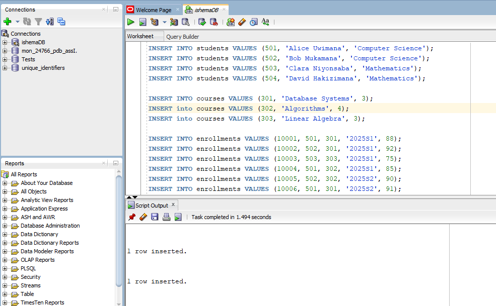
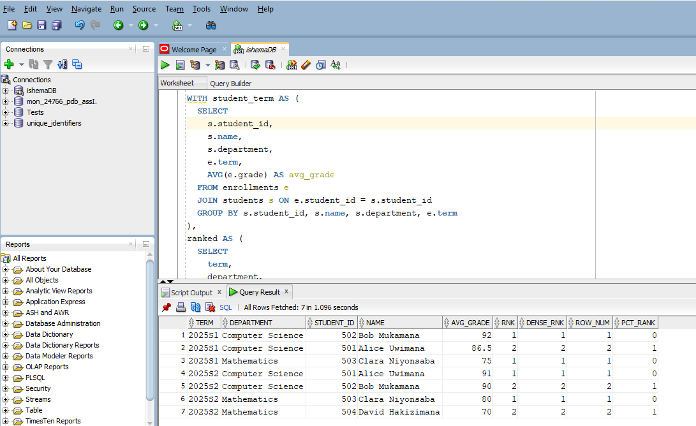
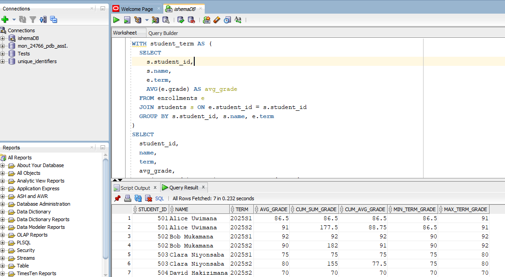
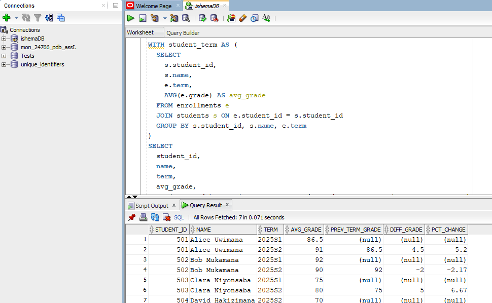
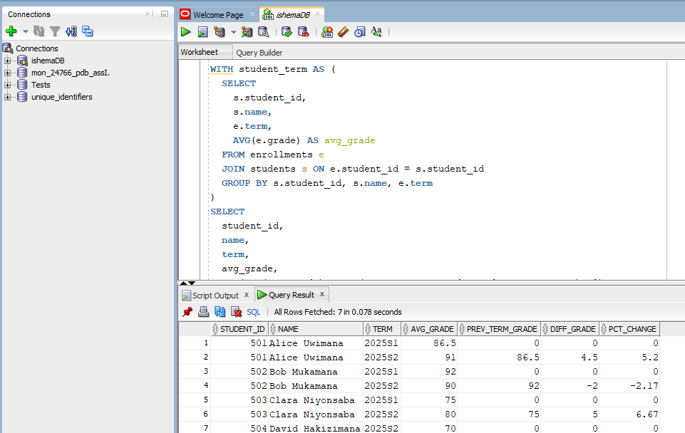

# Window Functions


Names:

* IRAGENA SHEMA Cedrick&nbsp;&nbsp;24766.


#  PL/SQL Window Functions Mastery Project


### Step1: Problem Definition 

## Business/Institutional Context:

A university’s academic affairs office wants to improve student performance monitoring across departments. The university offers many courses, and students register in those courses each term. The administration wants to analyze grades over time, identify top-performing students, and segment students by performance quartiles.

## Data Challenge:

Despite collecting enrollment and grade data each term, the university struggles to quickly gain insights like identifying top students each semester, tracking individual performance over time, and classifying students into performance tiers for targeted support.

## Expected Outcome:

By using window functions, the university can rank top students by department and term, track GPA trends over time, measure academic improvement or decline between terms, segment students into performance quartiles, and calculate moving GPA averages to support academic advisors and leadership.

### Step2: Success Criteria

## 5 measurable goals:

1.	Top 5 students per department/term → via RANK() or DENSE_RANK()
2.	Running cumulative GPA or grade sum per student over terms → via SUM() OVER()
3.	Term-over-term improvement (grade change % or difference) → via LAG() / LEAD()
4.	Student performance quartiles → via NTILE(4)
5.	3-term moving average of GPA or grade sum → via AVG() OVER()


### Step3: Database Schema

| Table        | Purpose                          | Key Columns                                                                 |
|--------------|----------------------------------|------------------------------------------------------------------------------|
| students     | Student master information       | `student_id` (PK), `name`, `department`                                     |
| courses      | Course catalog                   | `course_id` (PK), `title`, `credit_hours`                                   |
| enrollments  | Records of students taking courses | `enrollment_id` (PK), `student_id` (FK → students.student_id), `course_id` (FK → courses.course_id), `term`, `grade` |


### Table creation and inserts

* Table creation

```sql
CREATE TABLE students (
  student_id NUMBER PRIMARY KEY,
  name VARCHAR2(100),
  department VARCHAR2(100)
);

```

```sql
CREATE TABLE courses (
  course_id NUMBER PRIMARY KEY,
  title VARCHAR2(200),
  credit_hours NUMBER
);

```

```sql
CREATE TABLE enrollments (
  enrollment_id NUMBER PRIMARY KEY,
  student_id NUMBER REFERENCES students(student_id),
  course_id NUMBER REFERENCES courses(course_id),
  term VARCHAR2(20),
  grade NUMBER  -- numeric grade, e.g. 0–100 or on scale
);

```

Screenshot:


<br><br><br><br>


* Query to insert data 

```sql
INSERT INTO students VALUES (501, 'Alice Uwimana', 'Computer Science');
INSERT INTO students VALUES (502, 'Bob Mukamana', 'Computer Science');
INSERT INTO students VALUES (503, 'Clara Niyonsaba', 'Mathematics');
INSERT INTO students VALUES (504, 'David Hakizimana', 'Mathematics');

INSERT INTO courses VALUES (301, 'Database Systems', 3);
INSERT into courses VALUES (302, 'Algorithms', 4);
INSERT into courses VALUES (303, 'Linear Algebra', 3);

INSERT INTO enrollments VALUES (10001, 501, 301, '2025S1', 88);
INSERT INTO enrollments VALUES (10002, 502, 301, '2025S1', 92);
INSERT INTO enrollments VALUES (10003, 503, 303, '2025S1', 75);
INSERT INTO enrollments VALUES (10004, 501, 302, '2025S1', 85);
INSERT INTO enrollments VALUES (10005, 502, 302, '2025S2', 90);
INSERT INTO enrollments VALUES (10006, 501, 301, '2025S2', 91);
INSERT INTO enrollments VALUES (10007, 503, 303, '2025S2', 80);
INSERT INTO enrollments VALUES (10008, 504, 303, '2025S2', 70);

```


Screenshot:




<br><br><br><br>


 ### Step4: Window Functions Implementation 


 ### 1. Ranking (ROW_NUMBER, RANK, DENSE_RANK, PERCENT_RANK)

 ```sql
-- Compute average grade per student per term in their department
WITH student_term AS (
  SELECT
    s.student_id,
    s.name,
    s.department,
    e.term,
    AVG(e.grade) AS avg_grade
  FROM enrollments e
  JOIN students s ON e.student_id = s.student_id
  GROUP BY s.student_id, s.name, s.department, e.term
)
SELECT
  term,
  department,
  student_id,
  name,
  avg_grade,
  RANK() OVER (PARTITION BY term, department ORDER BY avg_grade DESC) AS rnk,
  DENSE_RANK() OVER (PARTITION BY term, department ORDER BY avg_grade DESC) AS dense_rnk,
  ROW_NUMBER() OVER (PARTITION BY term, department ORDER BY avg_grade DESC) AS rownum,
  PERCENT_RANK() OVER (PARTITION BY term, department ORDER BY avg_grade DESC) AS pct_rank
FROM student_term
WHERE RANK() OVER (PARTITION BY term, department ORDER BY avg_grade DESC) <= 5
ORDER BY term, department, rnk;

```


* **Interpretation:** 

&nbsp;&nbsp;&nbsp;This query compares each order amount with the previous and next ones using LAG() and LEAD().<br>

•	This gives the top up to 5 students in each department in each term by average grade.
•	RANK() gives ties the same rank and may skip ranks.
•	DENSE_RANK() gives ties the same rank but does not skip.
•	ROW_NUMBER() forces a unique ordering (even ties get arbitrary order).
•	PERCENT_RANK() gives the relative standing (between 0 and 1) of each student in the partition.


Screenshot:



<br><br><br>

### 2. Aggregate (SUM, AVG, MIN, MAX) with frame clause

```sql
WITH student_term AS (
  SELECT
    s.student_id,
    s.name,
    e.term,
    AVG(e.grade) AS avg_grade
  FROM enrollments e
  JOIN students s ON e.student_id = s.student_id
  GROUP BY s.student_id, s.name, e.term
)
SELECT
  student_id,
  name,
  term,
  avg_grade,
  SUM(avg_grade) OVER (PARTITION BY student_id ORDER BY term
                       ROWS BETWEEN UNBOUNDED PRECEDING AND CURRENT ROW) AS cum_sum_grade,
  AVG(avg_grade) OVER (PARTITION BY student_id ORDER BY term
                       ROWS BETWEEN UNBOUNDED PRECEDING AND CURRENT ROW) AS cum_avg_grade,
  MIN(avg_grade) OVER (PARTITION BY student_id) AS min_term_grade,
  MAX(avg_grade) OVER (PARTITION BY student_id) AS max_term_grade
FROM student_term
ORDER BY student_id, term;

```

* **Interpretation:**

&nbsp;&nbsp;&nbsp;Ranks orders within each region. RANK() may skip ranks on ties, while DENSE_RANK() doesn't.<br>

•	SUM(...) OVER gives cumulative sum of term averages for each student (in term order).
•	AVG(...) OVER with the same frame gives cumulative average (rolling average up to current term).
•	MIN(...) and MAX(...) over the partition (no ordering) yield the minimum and maximum term average grade ever achieved by that student.


Screenshot:


<br><br><br>


### 3. Navigation (LAG, LEAD) and growth or difference calculations

```sql
WITH student_term AS (
  SELECT
    s.student_id,
    s.name,
    e.term,
    AVG(e.grade) AS avg_grade
  FROM enrollments e
  JOIN students s ON e.student_id = s.student_id
  GROUP BY s.student_id, s.name, e.term
)
SELECT
  student_id,
  name,
  term,
  avg_grade,
  NVL(LAG(avg_grade) OVER (PARTITION BY student_id ORDER BY term), 0) AS prev_term_grade,
  NVL(avg_grade - LAG(avg_grade) OVER (PARTITION BY student_id ORDER BY term), 0) AS diff_grade,
  CASE
    WHEN LAG(avg_grade) OVER (PARTITION BY student_id ORDER BY term) IS NULL THEN 0
    ELSE ROUND(
      (avg_grade - LAG(avg_grade) OVER (PARTITION BY student_id ORDER BY term))
      / LAG(avg_grade) OVER (PARTITION BY student_id ORDER BY term) * 100, 2
    )
  END AS pct_change
FROM student_term
ORDER BY student_id, term;

```

* **Interpretation:** 

&nbsp;&nbsp;&nbsp;Filters to get the top 3 highest orders per region.<br>

•	LAG(...) gives the previous term’s average grade for that student (if exists).
•	diff_grade is absolute difference.
•	pct_change is percentage change (growth or decline) from previous term.


Screenshot:


<br><br><br>


### 4. Distribution (NTILE, CUME_DIST)

```sql
-- Overall average grade per student across all terms
WITH student_overall AS (
  SELECT
    s.student_id,
    s.name,
    s.department,
    AVG(e.grade) AS overall_avg
  FROM enrollments e
  JOIN students s ON e.student_id = s.student_id
  GROUP BY s.student_id, s.name, s.department
)
SELECT
  student_id,
  name,
  department,
  overall_avg,
  NTILE(4) OVER (ORDER BY overall_avg DESC) AS quartile_rank,
  CUME_DIST() OVER (ORDER BY overall_avg DESC) AS cumulative_dist
FROM student_overall
ORDER BY overall_avg DESC;

```

* **Interpretation:**

&nbsp;&nbsp;&nbsp;Retrieves the first 2 orders per region based on the order date.<br>

•	NTILE(4) divides students into 4 buckets (quartiles), highest average in quartile 1, etc.
•	CUME_DIST() gives for each student the fraction of students with average grade ≤ that student (a cumulative percentile).


Screenshot:


<br><br><br>


### Step6: Results Analysis 

1.	Descriptive — “In term 2025S1, the top students in Computer Science had average grades of 92, 88, 85, etc. Student 502’s grade improved from 90 to 92 in next term, while student 501 dropped. Quartile analysis shows 25% of students are in top quartile with averages above 90.”
2.	Diagnostic — “Student 502 improved due to better course selection or workload adjustments; student 501’s dip may be due to a difficult course or external factor. Students in lower quartiles share pattern of low grades in core required courses.”
3.	Prescriptive — “Provide tutoring or mentoring to students in quartile 3 to push them into higher quartiles. Monitor students whose term-over-term decline is steep and intervene early. Encourage students to avoid overloading difficult courses in same term.”


## Summary Table

| No. | Query Type | Purpose / Description | SQL Functions Used | Real-Life Application Example |
|-----|------------|----------------------|-------------------|------------------------------|
| 1 | Compare with Previous/Next | Compare value with previous/next row chronologically | LAG(), LEAD(), CASE | E-commerce sales trends |
| 2 | Ranking Within a Category | Rank records inside a category | RANK(), DENSE_RANK(), PARTITION BY, ORDER BY | Top employees or orders by region |
| 3 | Top 3 Records per Category | Return top 3 values per group while handling ties | DENSE_RANK(), PARTITION BY, ORDER BY | Top-selling products per category |
| 4 | First 2 Records per Category | Find first 2 entries from each category based on date | ROW_NUMBER(), PARTITION BY, ORDER BY | Early adopters per region |
| 5 | Aggregation with Window Functions | Max value per group and overall for comparison | MAX() OVER (PARTITION BY ...), MAX() OVER () | Compare customer orders with top regional and overall orders |


### Step 7 — References 

1.	“Window Functions in SQL” — freeCodeCamp tutorial FreeCodeCamp
2.	“6 Most Useful SQL Window Functions You Should Know” — Analytics Vidhya Analytics Vidhya
3.	Wikipedia article “Window function (SQL)” Wikipedia
4.	“SQL Window Functions explained through 4 real-world examples” — Medium article Medium
5.	“SQL Window Functions: RANK and DENSE_RANK” — SQLServerCentral SQLServerCentral
6.	“Learning T-SQL Window Functions” — Aaron Bos aaronbos.dev
7.	“Optimization of Analytic Window Functions” (academic) arXiv
8.	“Support Aggregate Analytic Window Function over Large Data by Spilling” arXiv
9.	“Statistical Dimension Identification for Student Progression System” (academic) arXiv


